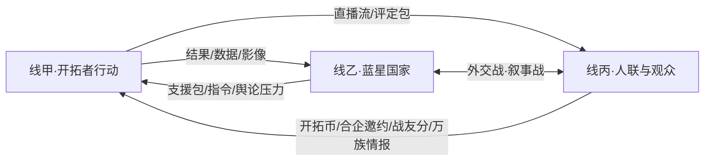

# 三线叙事总纲

> **硬规则**：小说 **同时三线推进**，不是「主线写完再切蓝星插曲」。  
> 任何一章都可主打一线，但卷内必须让三线 **互相咬合**。

## 三线定义

| 线 | 名称 | 舞台 | 写什么 | 爽点入口 |
|----|------|------|--------|----------|
| **线甲** | **考核开拓线** | 考核星系 | 国运选拔：全员以 **开拓者** 身份建基地、开矿、交战、升本、交协议 | [[三线爽点设计]] · [[基地1-10本升级路线]] |
| **线乙** | **蓝星反馈线** | 平行地球（冷战延续） | 各国政府对开拓者行为/结果的实时或准实时反馈：外交、军演、舆论、资源支援、制裁与反制裁 | [[蓝星冷战格局]] · [[国运舆论战]] |
| **线丙** | **人联侧视线** | 人联内部 + 跨星直播网 | 选拔官、考核裁判、编制评审；观众打赏评论；**大人物私聊/合伙**；顺带透露 **万族战线** 真实战况 | [[直播网结构]] · [[直播经济与双轨边界]] |

## 身份铁律（纠正旧误解）

```
被选中 → 进入考核星系 → 身份统一为「开拓者」
```

- 对标《无尽的拉格朗日》：**人人都是开拓者玩家**，不是「有的人是舰长、有的人还不是开拓者」。  
- 蓝星 **现实职业（L0）**、考核内 **职能分工（L1）** 只是开拓者的 **背景与岗位**，**不是** 另一种身份等级。  
- 详见 [[00-现实身份总览]] · [[选拔与编队逻辑]]。

## 因果闭环（三线如何互喂）



| 触发（线甲） | 线乙反应 | 线丙反应 |
|--------------|----------|----------|
| 华国拿下关键矿带/节点 | 亚太挑衅降调 or 反华话术升级 | 直播热搜；人联侧写「组织力」 |
| 修科融合首秀 | 国内动员/技术保密令 | **巨企/禁卫/人联高层私信** |
| 灰黑开拓者越界 | 他国舆论战+国内法务危机 | B4 编制风险、打赏两极 |
| 多国夹击主角团 | 蓝星紧急同盟/制裁 | 观众站队、帝国侧看戏 |

## 篇幅节奏（对齐用户规划）

| 参数 | 设定 |
|------|------|
| 单卷 = 一考核星系/赛季感 | **40–50 天** 叙事时间（类游戏赛季） |
| 日更感 | **3–5 章/天**（写作产能参考，非必须日更） |
| **每卷章数** | **200–250 章** |
| 全书 10 卷 | 约 **2000–2500 章**；2000 字/章 → 约 **400–500 万字** 量级 |

### 单卷内三线占比建议（可调）

| 阶段（卷内） | 线甲 | 线乙 | 线丙 |
|--------------|------|------|------|
| 开局 0–20%（落地/1–3 本） | 55% | 25% | 20% |
| 中段 20–70%（4–7 本·协议主线） | 50% | 25% | 25% |
| 高潮 70–90%（8–10 本·决战/交卷） | 55% | 20% | 25% |
| 结算 90–100%（国运分+编制夜） | 30% | 35% | 35% |

### 前期高压修正（V01–V03 · R17）

| 阶段 | 线甲 | 线乙 | 线丙 | 说明 |
|------|------|------|------|------|
| 开局 0–20% | **48%** | **32%** | 20% | 落地即多线绞杀 |
| 中段 | **50%** | **30%** | 20% | 每 3–5 章切乙/丙 |
| 高潮 | 52% | 28% | 20% | 险胜+反噬 |

细则：[[前期高压节奏设计]]

## 与旧「三线信息差」的关系

- [[三线信息差]]：**同一事件在三条线上的「真相度」差异**（戏剧反差工具）。  
- **本页**：叙事结构与因果主轴。  
- 写戏时两页一起用：结构定切谁，信息差定「谁被骗」。

## 交叉链接

- [[世界观总纲]] · [[分卷规划]] · [[三线爽点设计]] · [[蓝星冷战格局]]  
- [[双轨评分逻辑]] · [[直播开拓币MOC]] · [[后方蓝星MOC]]
