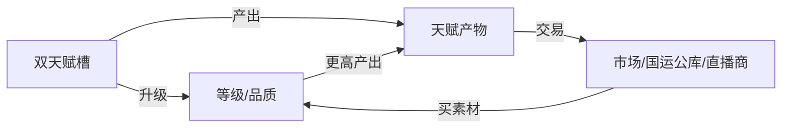

# 天赋：升级 · 交易 · 产出

> 承接 [[开拓者双天赋体系]]。  
> 用户硬规则：**天赋可以升级、可以交易、可以产出**。  
> 本页把三条做成可写、可制衡的经济与成长环，避免「买满就无敌」。

## 灵感来源（必填）

| 来源 | 提取 |
|------|------|
| 用户硬设定 | 升级 / 交易 / 产出 |
| 拉格朗日 | 蓝图加点、资源产销、联络站贸易感 |
| 本库 | 金属晶体重氢、电子货币、开拓币、双轨评分 |

## 总览环

| 动词 | 一句话 | 主要对象 |
|------|--------|----------|
| **升级** | 用素材+条件抬槽0/槽1强度与效率 | 本尊协议内的天赋 |
| **产出** | 天赋运行时 **生成可持有物/资源/增益包** | 产物条目 |
| **交易** | 产物、升级素材、可剥离残片可换手 | **不是**随便卖掉「我是开拓者」的身份 |

---

## 一、升级（Upgrade）

### 1.1 两条升级线

| 线 | 对象 | 升什么 | 上限感 |
|----|------|--------|--------|
| **槽0 紧急避险** | 全员同模板 | 冷却↓、锁血窗↑、落点偏差↓、携带外围比例↑ | **不能**到「随意定点闪现」满控 |
| **槽1 特质天赋** | 个人系 | 等级、半径、强度、产出速率、主动技段数 | 有品质阶 + 执照门槛 |

### 1.2 等级与品质（写作用阶）

**等级 Lv.1–10**（可与基地本级叙事对齐，非强制同数）：

| Lv | 语感 |
|----|------|
| 1–2 | 初醒，误触多 |
| 3–5 | 考核主力段，光环/产出稳定 |
| 6–8 | 可上大型会战表 |
| 9–10 | 准指挥官/前线模板；人联侧写重点 |

**品质**（可选第二轴，防纯堆级）：

`凡品 → 精良 → 稀有 → 史诗 → 传说（协议级）`

- 升级素材主要抬 **Lv**  
- 稀有事件/遗迹/修科/巨企合作抬 **品质**（或解锁进阶名）

### 1.3 升级素材（分类）

| 类型 | 例 | 来源 |
|------|-----|------|
| **基础饲喂** | 金属/晶体/重氢折算的「协议能量」 | 采矿、贸易 |
| **战勋催化** | 击毁、救援、协议交付积分 | 战斗与任务 |
| **同系残片** | 战意残片、救治残片…… | 产出、掉落、交易 |
| **异质触媒** | 特洛伊晶体、遗迹核心、修科丹剂 | 分卷高光 |
| **开拓币特批** | 直播商城「催化剂」 | 打赏经济（≠国运分） |

### 1.4 升级条件（防无脑）

1. **冷却**：大升有「稳固期」，连升易 **天赋躁动**（误触发、产出污染）。  
2. **岗位匹配**：槽1 与 L1 长期错位 → 升级效率↓（医生硬堆战意光环可以，但贵且不稳）。  
3. **B4 红线**：用禁术/献祭/虫肉强行升级 → 可能涨战力但编制否决。  
4. **槽0 特规**：紧急避险升级 **不消耗「卖身契约」**；人联禁止把槽0 剥离出售（见交易）。

### 1.5 升级名场面（写作）

- 升本前夜赌升槽1，产物暴增撑过资源坑  
- 槽0 升到「落点略可选」救国运  
- 主角修科 **跳品质** 引发直播间巨企疯抢残片  

---

## 二、产出（Produce）

> 天赋不只是光环，还是 **小型生产线/生成器**。  
> 「产出」= 可进仓库、可消耗、可交易、可上交国运公库的东西。

### 2.1 产出三态

| 态 | 说明 | 例 |
|----|------|-----|
| **被动滴灌** | 时间/驻留产生 | 镇心→「凝神锭」；周转→损耗返还券 |
| **触发结算** | 战斗/急救/维修后结算 | 战意→「余勇弹药包」；救治→「急救稳剂」 |
| **主动萃取** | 主动关闭光环一段时间，换一波产物 | 高风险：窗口期 deduff |

### 2.2 按天赋方向的产物示例

| 天赋向 | 产物名（可改） | 用途 | 升级后 |
|--------|----------------|------|--------|
| 战意/火力 | 余勇弹、射校芯片 | 弹药/调校加速 | 数量↑品质↑ |
| 救治 | 稳剂、止血雾剂 | 医疗耗材 | 可量产野战箱 |
| 抢修 | 速凝胶、结构钉 | 损管 | 舰级通用 |
| 统御 | 指令缓存、集结信标 | 缩短集结 | 同盟可共享 |
| 识破 | 敌情简报晶片 | 情报分 | 可卖他国（外交戏） |
| 解析 | 研究进度条、调校剂 | 科研 | 蓝图亲和 |
| 镇心/道系 | 清心符墨、抗侵染香 | 士气/亚空间 | 主角修科特化 |
| 器道共鸣 | **模组胚、道纹回路片** | 独特改装 | 巨企要订货 |
| 紧急避险（槽0） | **避险余波·定位残渣** | 升级槽0/研究闪现 | 低产、高价 |

### 2.3 产出规则（硬）

1. **有上限**：仓库格/日产量/协议配额，防无限刷。  
2. **与升本/船坞挂钩**：高等级产物可能要 **工业区等级** 才能封装。  
3. **污染风险**：虫区、亚空间产的东西可能带 **侵蚀标签**（V05/V10）。  
4. **国运公库**：队长可征调产物 → A3/A5；私吞 → B4/内讧戏。  
5. **产出≠天赋本体**：卖掉全部产物不会失去天赋，但可能饿死升级链。

### 2.4 产出 × 经济

| 货币/资源 | 关系 |
|-----------|------|
| 金属晶体重氢 | 产物可 **部分替代** 或加速转化 |
| 电子货币 | 联络站收购产物 |
| 开拓币 | 观众买「限定催化/皮肤式封装」；**不直接当国运分** |
| 国运 | 上交战略产物计 A |

---

## 三、交易（Trade）

### 3.1 什么能交易

| 可交易 | 说明 |
|--------|------|
| **天赋产物** | 主流通货 |
| **升级素材 / 同系残片** | 玩家间、国家间、巨企订单 |
| **天赋残响（可装备插件）** | 从高Lv槽1 **剥离的弱化复制**；有时限/衰减 |
| **萃取权/订单** | 约定「未来 N 日产出归买方」 |

### 3.2 什么不能（或极难）交易

| 不可/严格限制 | 原因 |
|---------------|------|
| **开拓者身份本身** | 协议绑定生命与编制 |
| **槽0【紧急避险】本体** | 人联保底人权/考核公平；禁止剥离 |
| **槽1 本体永久转让** | 默认 **不可卖号式卖天赋**；否则国运崩坏 |
| **完整无衰减复制** | 禁止；最多残响/租借 |

> 若剧情需要「夺天赋」：走 **邪神污染、禁实验、犯罪** 线，必付 B4/人生代价，不作常规市场。

### 3.3 交易渠道

| 渠道 | 谁 | 戏 |
|------|-----|-----|
| **国运公库内配** | 本国内 10 人 | 团结 vs 谁多拿 |
| **跨国外交物物** | 国家代表 | 线乙+线甲 |
| **联络站/中立市场** | 考核内 NPC | 物价随战局 |
| **直播巨企订单** | 线丙 | 订购器道产物、包圆残片 |
| **灰市** | 灰黑开拓者 | 便宜污染货；B4 雷 |

### 3.4 残响（可交易的「弱天赋」）规则

1. 从槽1 **Lv≥某阈值** 可 **萃取残响**（自己降层或进冷却）。  
2. 残响给人装备：得 **短时弱光环/弱产出**，非永久第二槽。  
3. 残响有 **绑定次数、衰减、排斥**（同时装太多会冲突）。  
4. 主角修科残响可能 **异常保值** → 交易战核心。

### 3.5 租借（可选子类）

- 「光环共享协议」：A 的救治光环在约定时间覆盖 B 舰队，收费产物或电子货币。  
- 结束即断；战场毁约 = 外交事件。

---

## 四、槽0 / 槽1 对照（升级·产出·交易）

| | 紧急避险（槽0） | 特质天赋（槽1） |
|--|----------------|-----------------|
| 升级 | 冷却、锁血、落点、携带比 | Lv、半径、强度、技能段 |
| 产出 | 定位残渣、避险日志数据（少） | **主产物来源** |
| 交易 | 只交易 **残渣/数据/升级剂**；本体禁售 | 产物+残片+残响；本体禁永久卖 |
| 戏剧 | 保命与评分观感 | 经济、build、外交、合企 |

---

## 五、与双轨 / 三线

| 线 | 升级 | 产出 | 交易 |
|----|------|------|------|
| 线甲 | 战前强化 | 填船坞/医疗 | 抢残片、卡对手 |
| 线乙 | 公布「天赋工业」刺激股市 | 战略物资回流蓝星叙事 | 国家间天赋贸易协定 |
| 线丙 | 巨企投催化 | 订制产物 | 直播拍卖残响 |

| 评分 | 例子 |
|------|------|
| A | 公库产物撑协议；交易换关键触媒 |
| B | 公平分配、守序贸易；灰市/夺天赋 = 风险 |

---

## 六、主角（破庙道士）特化

| 项 | 设计 |
|----|------|
| 升级 | 修科可 **降素材或跳品质**（有限次，防崩） |
| 产出 | 器道系 → 模组胚、符纹回路、稳剂变体；巨企点名要 |
| 交易 | 可卖产物与残响；**不卖**清规底线（拒邪神单） |
| 爽点 | 「破庙小炉」产能打脸工业国；直播拍卖 |

详见 [[主角-破庙道士]] · [[炼丹炼器与修科对接]]。

---

## 七、写作红线

1. 交易 **不是** 付费开第三天赋槽。  
2. 产出有软顶，避免第一章无限弹药。  
3. 升级有稳固期与错配惩罚。  
4. 槽0 保命底线不进自由市场。  
5. 正文用 **一单交易、一次产出结算、一次升级仪式** 展示系统，少贴全表。

## 交叉链接

- [[开拓者双天赋体系]] · [[特质天赋示例库]]  
- [[资源与经济体系]] · [[开拓币用途与纪律]] · [[直播经济与双轨边界]]  
- [[基地1-10本升级路线]] · [[双轨评分逻辑]]
