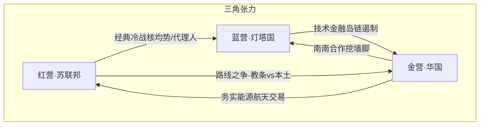

# 蓝星三营冷战格局（平行史总纲）

> **硬前提**：苏联 **从未解体**；冷战 **延续至考核当代**。  
> 因此国家间关系 **不能照搬 21 世纪现实外交**，须按三营结构重写。  
> 50 国数量不变；**对华影响力五档** 控制出场顺序与分量 → [[对华影响力五档与出场表]]。

## 灵感来源（必填）

| 来源 | 提取 |
|------|------|
| 用户硬设定 | 三营：苏共国际 / 美资殖民 / 华本土化+命运共同体 |
| 历史机制 | 冷战两极、中苏分裂、不结盟、经济共同体、代理人战争 |
| 本库 | [[蓝星冷战格局]]（旧摘要）· [[国家总览]] · [[三线叙事总纲]] |

---

## 一、三营总表

| 营 | 全称（设定） | 首领 | 意识形态语感 | 经济共同体 | 对华默认 |
|----|--------------|------|--------------|------------|----------|
| **红营** | **共产国际集团**（教条国际主义） | **苏联邦**（核心民族面：[[战斗民族]]） | 偏理想化、教条、国际革命话语 | **经互会式** 大一统计划与能源绑定 | **同祖戒备**：认「社」不认「本土化」 |
| **蓝营** | **资本殖民集团** | [[灯塔国]] | 自由市场+军事同盟+资源/金融殖民 | **美元—同盟产业链** + 围堵清单 | **双重遏制** 对象之一（苏+华） |
| **金营** | **命运共同体营**（社会主义本土化发展中国家） | [[华国]] | 发展优先、主权、互利、人类命运共同体 | **基建—贸易—产能** 网络（类带路） | 主角营；开局话语权弱 |

### 1.1 为何不是「华苏一家」

平行史里苏联仍在，**中苏式路线矛盾被冻成常态**：

| 议题 | 红营（苏） | 金营（华） |
|------|------------|------------|
| 革命输出 | 强调国际共运领导权 | 反对外来干涉、强调各国道路 |
| 经济 | 计划一体化、能源绑死 | 混有市场工具的发展型国家 |
| 对蓝 | 全面对峙 | 斗而不破、经贸穿插（开局被压） |
| 对华叙事 | 「修正/分裂国际」 | 「教条误南」 |

→ 战场（考核）上可战术配合；蓝星谈判桌上 **要价与甩锅** 不断。  
→ 爽点不是「联苏灭美」，而是华国把 **南营做实**，逼两极承认第三极。

### 1.2 蓝营为何更「殖民」

冷战未结束 → 蓝营少了现实里的「全球化红利叙事」，更多：

- 同盟军政一体化  
- 资源产地政治附庸化  
- 对金营技术禁运 + 对红营军备竞赛 **双线烧钱**  
- 欧洲 **战略自主空间小于现实 2020s**（高卢鸡仍叫自主，但底气更虚）

### 1.3 金营为何能成「营」

开局金营 **不是** 对等超级大国集团，而是：

- 华国为枢纽  
- 大量发展中国家 **要贷款、基建、不干涉**  
- 用「命运共同体」话语对抗红营教条与蓝营殖民  

考核线乙的终点：金营从「话语」变成 **可验证的第三秩序**。

---

## 二、地缘板块推演

### 2.1 欧亚核心

| 板块 | 冷战态 | 对华含义 |
|------|--------|----------|
| **苏联邦本土+近邻** | 未解体；东欧多仍在红营安全伞下 | 华国北方/中亚接触面仍是「红营规矩」 |
| **中亚粮仓** | 联盟内加盟/高度自治，能源走廊 | 华要油气管 = 必须给苏联面子 |
| **乌友/波波国** | 更偏红营前线或紧箍卫星，而非「全面西转」 | 现实乌波叙事 **作废**；改写为红蓝拉锯带 |
| **塞铁** | 可走「非苏非美亲华」缝 | 金营在欧洲的道义支点 |
| **西欧（雾都/高卢/战车/面/风车）** | 蓝营工业军事支柱；反苏为主、附带遏华 | 战车国精密工业=技术战关键 |

### 2.2 亚太岛链与印太

| 板块 | 冷战态 | 对华含义 |
|------|--------|----------|
| **霓虹/泡菜/袋鼠/菲佣** | 蓝营前沿堡垒，驻军与禁运更硬 | **开局周边高压** 主来源 |
| **越鸡** | 历史纠葛 + 可被蓝拉拢制华，又忌红 | 小国挑衅线经典 |
| **千岛/大马/人妖/狮城** | 摇摆；航道与市场 | 东盟「选边难」戏 |
| **天竺国** | 不结盟外壳，实则在蓝苏华间套利；陆权摩擦在 | 区域强国档 |
| **巴铁** | 金营铁杆；对苏复杂、对蓝复杂 | 华国西向战略支点 |

### 2.3 中东

| 板块 | 冷战态 | 对华含义 |
|------|--------|----------|
| **土豪国/酋长国** | 油美元仍偏蓝，但对华卖油打开 | 务实能源 |
| **波斯国** | 反蓝；红想拉、金也拉 | 反制裁叙事 |
| **犹大国** | 蓝营高技术与情报节点 | 黑科技对手/偶合作 |
| **奥斯曼** | 三边骑墙 | 走廊杠杆 |

### 2.4 美洲

| 板块 | 冷战态 | 对华含义 |
|------|--------|----------|
| **灯塔+枫叶** | 蓝营司令部与资源后方 | 定局对手 |
| **仙人掌** | 近邻依附蓝，偶有离心 | 北美供应链 |
| **桑巴/探戈/印加/长条** | 南美成红蓝金 **三角拉票区** | 资源+票仓 |
| **石油猫/咖啡国** | 石油猫偏反蓝；咖啡国偏蓝 | 代理人味道 |

### 2.5 非洲

| 板块 | 冷战态 | 对华含义 |
|------|--------|----------|
| **坦桑/高原/安哥拉石油等** | 华基建+历史情谊 → 金营基本盘 | 线乙道义高光 |
| **钴矿国/尼日/彩虹** | 资源竞赛场；三营都伸手 | 资源战争戏 |
| **金字塔/北非门户/阿国** | 枢纽与油气；欧非通道 | 中等棋手 |

---

## 三、三大宏观经济共同体

| 共同体 | 主导 | 成员逻辑 | 武器 | 脆弱点 |
|--------|------|----------|------|--------|
| **经互会—能源圈** | 红营 | 计划分工、卢布/内部清算、军工一体化 | 断气、军援、意识形态审查 | 效率低、卫星国离心、与华技术标准不合 |
| **同盟—美元圈** | 蓝营 | 军盟+美元结算+出口管制清单 | SWIFT式断链、禁运、岛链军演 | 双线遏制成本、南营用本币/物物砸缝 |
| **发展—基建圈** | 金营 | 项目换资源、产能合作、不附带政权改造 | 铁路港口、工业园、紧急援助 | 开局资本与话语弱；被红骂修、被蓝骂债 |

### 三营经贸冲突母题（可反复写）

1. **标准战**：红营轨距/工业标准 vs 华标准 vs 蓝营认证  
2. **结算战**：美元清算 vs 内部账户 vs 人民币/物物  
3. **资源战**：钴锂油粮的长协与断供  
4. **人才战**：考核选人的意识形态政审  

---

## 四、对华压力与线乙弧（对齐五档）

开局华国：

- 东线：蓝营岛链（霓虹/泡菜/菲佣/袋鼠）  
- 南线：天竺套利 + 越鸡摩擦  
- 北/西：红营教条施压 + 中亚能源看脸色  
- 全球：蓝金融科技断供 + 红「领导权」挖墙脚  

**线乙爽点**仍是阶梯卸载，但对手 **阵营标签要正确**：

| 卷段 | 主对手类型 | 营 | 档 |
|------|------------|-----|-----|
| V01–V02 | 周边挑衅、舆论脏水 | 蓝前沿+摇摆 | 档2–3 为主 |
| V03–V05 | 区域强国军演/脱钩 | 蓝+骑墙 | 档2 |
| V06–V08 | 超级大国谈判桌 | **蓝+红同时出场** | 档1 |
| V09–V10 | 秩序改写、命运共同体 | 三营重构 | 档1 定局 + 金营基本盘高光 |

---

## 五、考核与三营

| 现象 | 写法 |
|------|------|
| 选人 | 红营重政审教条；蓝营重资本/军工背景；金营重混编实干 |
| 蓝星支援包 | 带意识形态标签与附加条件 |
| 开拓者冲突 | 同星系可能「营级仇恨」大于个人 |
| 直播 | 三套解说：教条正义 / 自由秩序 / 发展共同体 |

---

## 六、写作红线

1. **禁止** 直接粘贴现实 2020–2026 外交新闻当设定。  
2. 苏联未解体 → 东欧、中亚、部分中东非洲关系 **必须改写**。  
3. 华苏 **不是** 自动盟兄；金红有缝才有戏。  
4. 正文用代称；三营可用「红营/蓝营/金营」或「国际派/同盟派/共同体派」。  
5. 不写成仇恨宣传册；国家理性与民粹分层写。

## 交叉链接

- [[对华影响力五档与出场表]] · [[蓝星冷战格局]] · [[国家总览]]  
- [[华国]] · [[灯塔国]] · [[战斗民族]] · [[三线爽点设计]]
